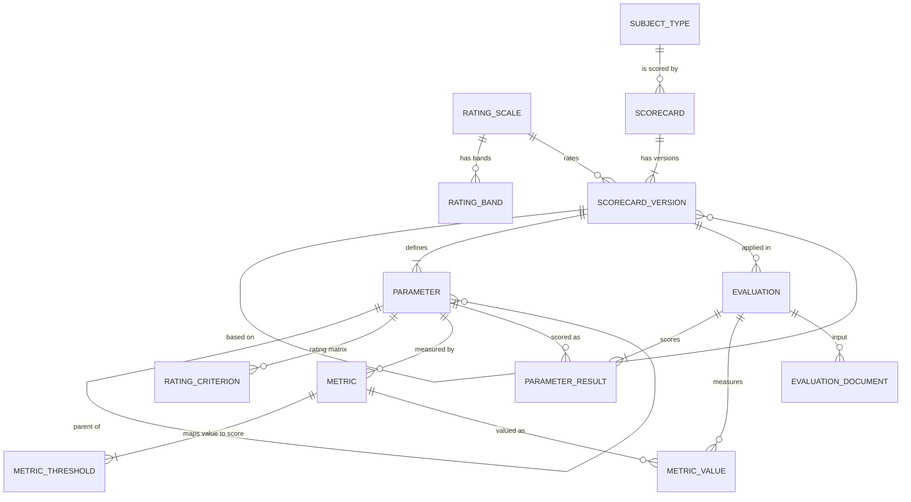

# Database Design (Cycle 1 · §7.1)

Relational, third normal form except where noted. SQLite for the pilot; the DDL (`docs/schema.sql`, generated from
`backend/app/models.py`) uses only portable constructs, so Postgres is a drop-in.

## Entity-relationship diagram

## Key design decisions

| Decision | Alternative rejected | Why |
|---|---|---|
| `scorecard` (identity) split from `scorecard_version` (content) | Single table with a version column | Evaluations must reference immutable content; library listing needs one row per scorecard. |
| Adjacency list (`parameter.parent_id`) | Fixed `level1..level4` columns; nested sets; closure table | Arbitrary depth with one table; trees are small (< 200 nodes) so recursive walks in the service layer are cheap; nested sets make editing painful. |
| `max_depth` as a version attribute validated in code | Schema-enforced depth | Depth is a business rule that varies per scorecard (a client email needs 1 level, an assessment 4). |
| Weights relative to siblings | Global weights that must sum to 100 | Users reason locally; renormalisation handles N/A for free. |
| Rating matrix as ranges (`score_min..score_max`) | One row per integer | Framework itself groups "0–3"; validator guarantees full, non-overlapping coverage. |
| Metrics + thresholds as rows | Formula strings | No expression parser to secure; thresholds are editable by non-engineers; validated for overlap/gaps. |
| `parameter_result` stores leaf **and** roll-up rows | Compute roll-ups on read only | BI needs parent-level averages with plain SQL; scores are recomputed and rewritten on every change, so there is no drift. |
| Computed fields denormalised on `evaluation` (`final_score`, `band_label`, `rag`, `quality_met`, `qtc_green`) | Compute on read | Lists and analytics over thousands of evaluations without re-running the engine. Always written by `services.recompute`. |
| `target_score` copied onto `evaluation` | Always read from version | Framework: target is set per context (POC 6, foundational 10). |
| `gate_failures` as JSON | Separate table | Always read together with the evaluation; never queried by field. Revisit if BI needs gate-level SQL. |
| `subject_ref` free text | FK to a subjects table | Subjects live in other systems (Jira, LMS). A subjects table is a Cycle 3 candidate when evaluation roll-ups across subjects arrive. |

## Integrity
- FKs with `ON DELETE CASCADE` inside a scorecard's own content; evaluations do **not** cascade from versions
  (published versions cannot be deleted; only drafts, which have no evaluations).
- CHECK constraints: statuses, aggregation methods, `weight >= 0`, `max_depth 1..6`, criterion range order, scale range.
- UNIQUE: scorecard code, (scorecard, version_no), (version, parameter code), (parameter, metric code),
  (evaluation, parameter), (evaluation, metric), (scale, band lower bound).
- SQLite FK enforcement is switched on per connection (`PRAGMA foreign_keys=ON`).

## Schema evolution log
| Change | Trigger |
|---|---|
| Duplicate parameter codes rejected at save (V015) instead of DB IntegrityError | Scenario I10 surfaced a 500 error |
| Analytics normalise scores to % of scale | Generated data mixed 0–10, 1–5, 0–100 averages (see PILOT_LOG) |
| `evaluation.origin`, `evaluation.origin_ref` + CHECK | Cycle 2 migration needs traceability to the source row |
| Structural errors blocked at draft save (inverted ranges, duplicate metric codes) | Cycle 2 corruption: DB constraints were stricter than save validation (500s) |
| IntegrityError → 409 E017 | Safety net so a missed rule can never surface as a 500 |

**Open:** no migration tool for this database yet (Alembic needed before any shared deployment).
