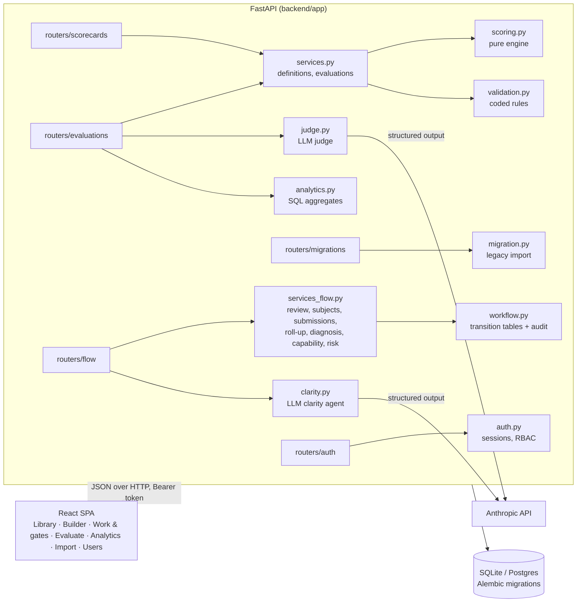

# Architecture

## Components

| Layer | Responsibility | Rule it enforces |
|---|---|---|
| `scoring.py` | Leaf scores, roll-ups, bands, gates, QTC | Pure and deterministic; no I/O. The only place maths happens |
| `validation.py` | Coded definition issues (V/W) | Errors block publishing; structural errors block saving |
| `workflow.py` | State tables + audit trail | Actions exist only where the table says; every transition audited |
| `services*.py` | All writes (API, generator, importer, tests) | One path for data, so every entry point obeys the same rules |
| `judge.py` | LLM proposals | Never computes scores; output sanitised against the scorecard |
| `clarity.py` | LLM task-clarity review | Advisory only; never edits a subject or blocks a workflow action |
| `analytics.py` | Read models | SQL aggregates; private self-appraisals excluded |
| `migration.py` | Legacy import | Preview never writes; commit goes through services |
| `auth.py` | Sessions & RBAC | Every router but `routers/auth` requires `Depends(auth.get_current_user)`; roles add to, never replace, identity checks |

## Key design decisions
1. **Scorecards are data.** Definitions are a JSON contract (`ScorecardDefinition`). The pilot and five other
   scorecards are files in `data/scorecards/`.
2. **Versions are immutable once published.** Evaluations reference exact versions, so history never changes meaning.
3. **A tree with relative weights.** An adjacency list supports any depth; `max_depth` is a per-scorecard rule.
4. **Transitions are tables.** New states or actions are data changes plus guards, and the exhaustive matrix test
   covers them automatically.
5. **Derived, never stored:** roll-up status and attention lists are computed from decisions. There's nothing to drift.
6. **Separation of duties by identity, roles on top.** Guards compare the authenticated user's `display_name` (never
   a client-supplied header — see docs/14_PHASE2_SECURITY_SPEC.md); roles gate categories of action but never
   substitute for an identity check like "not your own submission".
7. **Concurrency:** optimistic `row_version` everywhere it matters, plus row locks on workflow actions (Postgres).

## Deployment
- **Pilot:** one process, SQLite, `uvicorn app.main:app` serving the API and the built UI.
- **Shared:** `docker compose up` (app with 2 workers, plus Postgres 16). The container runs `alembic upgrade head`
  on start (`SCORECARD_AUTO_CREATE=0`).
- **Config:** `SCORECARD_DB_URL`, `ANTHROPIC_API_KEY`, `SCORECARD_JUDGE_MODEL` (default `claude-opus-5`),
  `RED_THRESHOLD`, `RED_WINDOW_DAYS`, `SCORECARD_AUTO_CREATE`.

## Security posture
- **Authenticated (Phase 2).** Every action requires a login; sessions are opaque bearer tokens, stored server-side
  as a hash, never the token itself. Roles (admin/designer/reviewer/lead/importer) gate categories of action; see
  docs/14_PHASE2_SECURITY_SPEC.md for the full model, including its honestly-named limitations (no SSO, no MFA,
  bearer token in `localStorage`).
- **Handled:** input contracts (finite numbers, sizes), no raw input echoed in errors, non-root container,
  prompt-injection instruction and output sanitisation for the LLM judge and the clarity agent, private
  self-appraisals and diagnosis/capability records redacted server-side, PBKDF2 password hashing, account lockout
  after repeated failed logins, a fixed-time login check so an unknown username can't be timed against a known one.

## Extension points (Phase 2 and beyond)
| Need | Where it plugs in | Status |
|---|---|---|
| SSO / authorisation | `app/auth.py` (session + RBAC), routers gated by `Depends(auth.get_current_user)` | Done — see docs/14_PHASE2_SECURITY_SPEC.md |
| Another LLM or judging strategy | `judge.Judge` protocol | Done (Cycle 1) |
| ODTQRC task definition | `objective`/`deliverable`/`quality_bar`/`risks` on `subject` (+ existing `due_at`/`budget`) and a clarity agent (`app/clarity.py`, same swappable-strategy shape as `judge.Judge`); `POST /api/subjects/{id}/clarity-check` | Done |
| Capability & competency (C1–C6) | `Capability` model: person + scorecard + level (1–6, novice→expert), append-only like `Diagnosis`; `POST`/`GET /api/capabilities` (lead-gated write, same privacy rule as diagnoses) | Done |
| Predictive & prescriptive analytics | `services_flow.risk_forecast`: a deterministic, fully-explained risk score (no ML) per open submission from signals already recorded (overdue, cost overrun, track record, low capability, resubmission), plus a recommended action from the same vocabulary `Diagnosis` uses; `GET /api/analytics/risk-forecast` (same privacy rule as diagnoses/capabilities) | Done |
